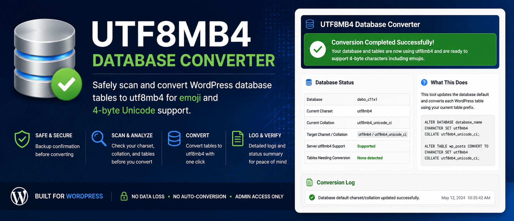

# LightMoving UTF8MB4 Converter


Safely scan and convert WordPress database tables to UTF8MB4 for emoji and 4-byte Unicode support.

---

## 🔍 Overview

LightMoving UTF8MB4 Converter helps modernize older WordPress databases that still use:

- latin1
- utf8
- legacy collations
- non-utf8mb4 table structures

The plugin scans your WordPress database tables, identifies tables needing conversion, and provides a safe administrator-controlled conversion workflow.

---

## ⚡ Features

- Database charset and collation scan
- WordPress table scan using the active table prefix
- utf8mb4 server capability detection
- Backup confirmation workflow
- Required CONVERT confirmation step
- Individual WordPress table conversion
- Clean conversion logging
- Responsive modern admin interface
- No automatic conversion on activation
- Direct Tools link from Plugins page

---

## 🖥 Designed For

This utility is especially useful for:

- older WordPress websites
- migrated hosting environments
- multilingual websites
- emoji support issues
- legacy latin1 databases
- utf8 compatibility upgrades
- Themify and older builder installs

---

## 🔒 Safety First

The plugin intentionally requires:

- administrator access
- backup confirmation
- manual CONVERT confirmation

No database conversion occurs automatically on activation.

---

## 📦 Installation

1. Upload the plugin to `/wp-content/plugins/`
2. Activate the plugin
3. Go to:

## 📜 Changelog

### 1.0.13
- Renamed plugin to **LightMoving UTF8MB4 Converter**
- Updated plugin slug to `lightmoving-utf8mb4-converter`
- Updated text domain references
- Fixed WordPress Plugin Check text domain mismatch warnings
- Improved WordPress.org compatibility and plugin distinction
- Preserved safe utf8mb4 conversion workflow
- Updated branding and release packaging

### 1.0.12
- Initial LightMoving branded release
- Updated plugin headers and readme references
- Renamed language template files
- Updated internationalization references

### 1.0.11
- Added conversion logging improvements
- Added backup confirmation workflow
- Improved database status reporting
- Improved admin interface styling

```txt
Tools → LightMoving UTF8MB4 Converter
